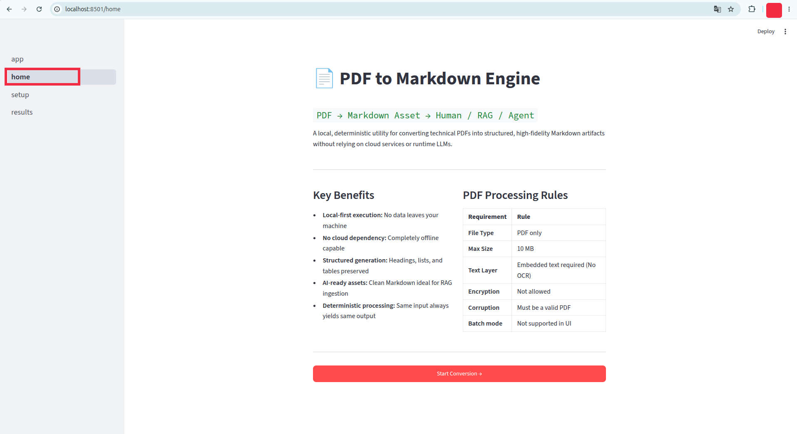
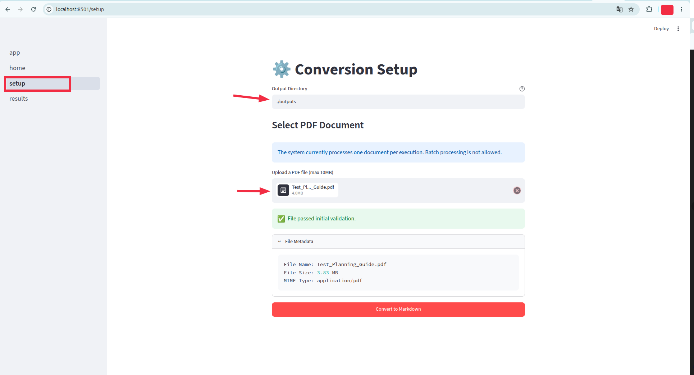
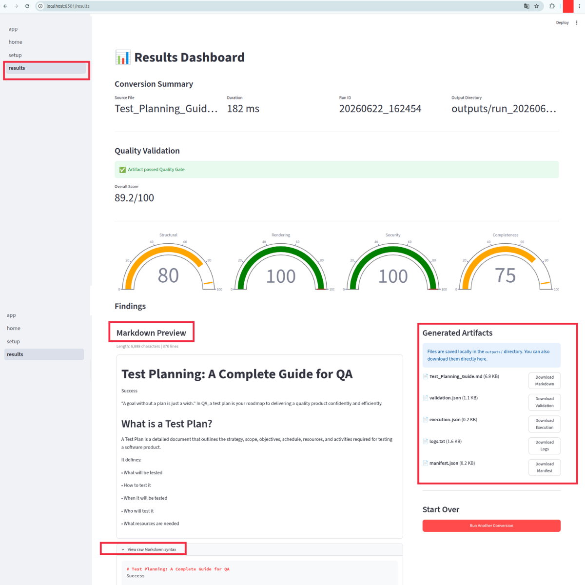
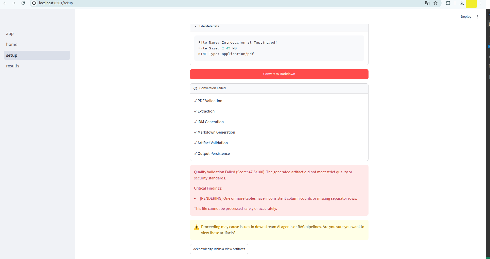
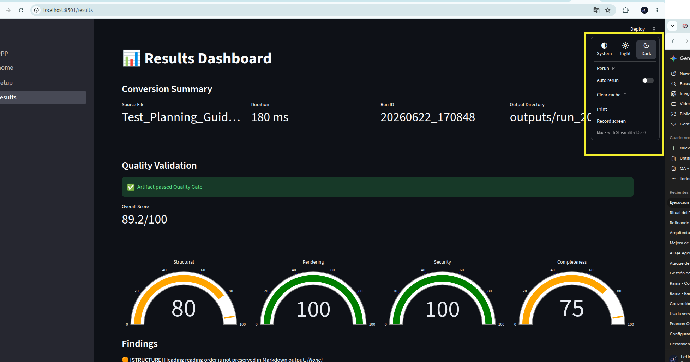

# User Interface (UI) Description

This document describes the Web UI Dashboard for the PDF-to-MD Engine Converter, built using Streamlit. The UI provides a visual, interactive layer over the core deterministic conversion pipeline.

## Overview

The application consists of **three primary pages**, leveraging Streamlit's multi-page architecture to strictly separate informational content from operational workflows and results visualization.

---

## 1. Home Page (`1_home.py`)

**Purpose:** Acts as the landing page and provides a high-level overview of the tool's capabilities, target audience, and architectural constraints.

**Expected Flow:**
1. The user navigates to the root application URL (e.g., `http://localhost:8501`).
2. The user reads the product vision, core principles (local-first, privacy-preserving, LLM-free runtime), and pipeline architecture.
3. The user uses the sidebar navigation menu to proceed to the Conversion Setup page.

**Expected Features:**
* Static, informational layout explaining the 5-stage conversion pipeline.
* Clear communication of tool constraints (e.g., max 10MB file size, native-text PDFs only).
* Persistent sidebar navigation.

---

## 2. Conversion Setup Page (`2_setup.py`)

**Purpose:** The operational hub of the application. This is where users configure settings, upload PDFs, trigger the conversion process, and handle any validation override logic before viewing results.

**Expected Flow:**
1. **Configuration:** The user specifies a target "Output Directory" via a text input field (defaults to `./outputs`).
2. **Upload:** The user uploads a single PDF document via the drag-and-drop zone.
3. **Pre-validation:** The system immediately runs client-side checks (Stage 1 Preprocessor rules).
    * *If invalid:* A descriptive error message is displayed (e.g., oversized file, invalid extension) and the workflow is halted.
    * *If valid:* The UI displays the extracted PDF metadata (file name, size).
4. **Conversion:** The user clicks the "Convert to Markdown" button.
5. **Processing:** A visual spinner indicates that the backend pipeline is executing.
6. **Failure / Override Handling:** 
    * *If Quality Gate Fails:* A warning alert is displayed on the setup page. The user is presented with an "Acknowledge Risks & View Artifacts" button to bypass strict validation failures.
7. **Handoff:** Upon successful conversion (or a manual override), the system saves the run results to the session state and automatically switches the user to the Results Dashboard.

**Expected Features:**
* **Custom Output Directory Input:** Text field to define where physical artifacts are saved locally.
* **Interactive File Uploader:** Drag-and-drop zone that accepts only `.pdf` files.
* **Dynamic Metadata Display:** Expandable container showing document properties.
* **Conversion Trigger:** Button to execute the backend pipeline synchronously.
* **Quality Gate Override UI:** Interactive UI to catch and bypass validation failures, strictly separating the error state from the results view.

---

## 3. Results Dashboard (`3_results.py`)

**Purpose:** The analytical hub of the application. This page is solely responsible for presenting the generated artifacts, displaying validation metrics, and offering export options.

**Expected Flow:**
1. **Summary Review:** The user reviews the conversion metadata (Source File, Duration, Run ID, Output Directory).
2. **Validation Review:** The user inspects the AI-driven Quality Validator scorecard, showing the Overall Score alongside Structural, Rendering, Security, and Completeness sub-scores.
3. **Result Visualization:** The generated Markdown content is rendered visually within a central column for immediate human inspection.
4. **Artifact Download:** The user uses the Artifact Explorer sidebar to download specific files (Markdown file, Validation JSON, Execution JSON, Logs, and Manifest).

**Expected Features:**
* **State Protection:** Redirects the user back to the Setup page if accessed without a valid conversion result in the session state.
* **Conversion Metrics Board:** 4-column metrics layout showing the run identifiers.
* **Scorecards / Validation Panel:** Visual representation of the 4 validation dimensions.
* **Markdown Preview Container:** An interactive text area to review the generated output directly in the browser.
* **Artifact Explorer:** A dedicated sidebar providing native Streamlit download buttons for all 5 generated assets.

---
## Extended Features

### Validation Warnings Handling (UX)
The setup page strictly separates failure states from results. If the Quality Validator flags issues (even if the user chooses to override them), the system displays a non-blocking warning banner.

**User Flow:**
1. Conversion completes with warnings.
2. A yellow banner appears on the Setup page: "Quality issues detected. Proceed to view artifacts?"
3. User clicks "Acknowledge Risks & View Artifacts".
4. UI navigates to the Results Dashboard, where the artifacts are displayed alongside the full validation report.

---
## Exteded Setup Features

### 1. Theme Preference
### 2. Rerun R
### 3. Auto Rerun 
### 4. Clear cache C
### 5. Print
### 6. Record Screen

**Streamlit References**
- Deploy:
  - streamlit.io/deploy
  - docs.streamlit.io/streamlit-community-cloud/get-started
  - Snowflake Information
  - Other platforms Information

